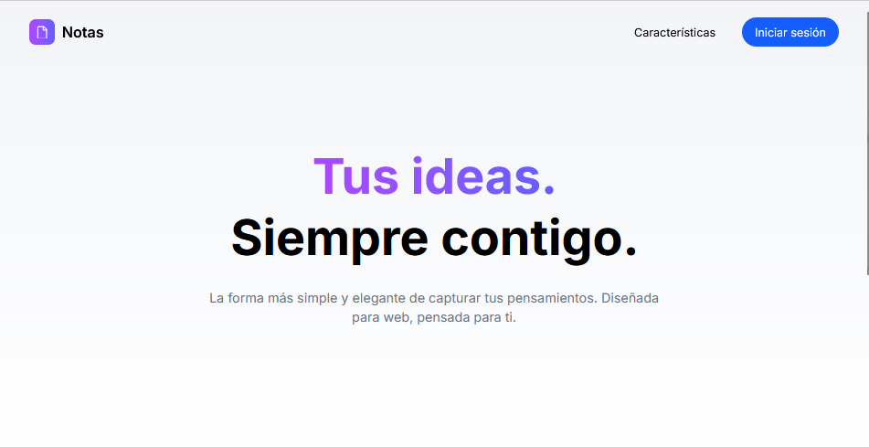
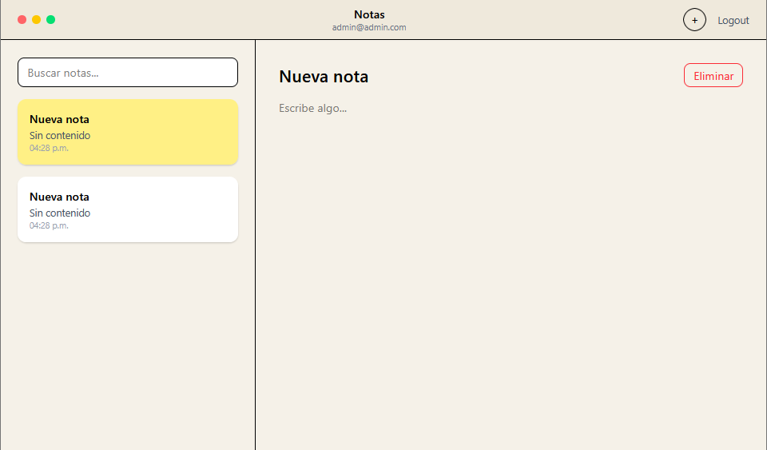

# 📝 Astro Notes App

A modern notes web application with authentication, autosave and a clean SaaS-style interface.

This project was built as part of my developer portfolio to demonstrate fullstack web development using modern tools.

---

## 🚀 Features

- User authentication (register / login)
- Create, edit and delete notes
- Autosave while typing
- Notes search
- Responsive interface
- Modern SaaS-style landing page

---

## 🛠 Tech Stack

- Astro
- TailwindCSS
- Supabase
- JavaScript

---

## 📸 Screenshots

### Landing Page

The landing page introduces the application and allows users to register or login using a modal authentication system.



---

### Notes Application

After authentication, users can manage their notes with autosave functionality and a clean editor interface.



---

## 📁 Project Structure

``` id="2zh6au"
src
 ├ components
 │   ├ Navbar.astro
 │   ├ Hero.astro
 │   ├ AppPreview.astro
 │   ├ Features.astro
 │   ├ Experience.astro
 │   ├ CTA.astro
 │   ├ Footer.astro
 │   └ AuthModal.astro
 │
 ├ pages
 │   ├ index.astro
 │   └ notes.astro
 │
 ├ lib
 │   └ supabase.ts
 │
 └ styles
     └ global.css
